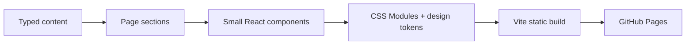
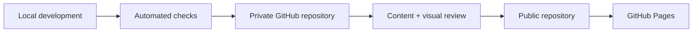

# Personal Website

A personal homepage in progress, built with React, TypeScript, and Vite. The visual direction combines a clean editorial layout with restrained scrapbook and notebook details.

The site is designed as one continuous page:

- Intro
- About
- My Journey: Shanghai → Cupertino → New York City
- Education: NYU Stern → Columbia University
- Elsewhere: Golf and Crochet
- Footer

## Design direction

The public [design brief](docs/DESIGN_BRIEF.md) explains how the site translates its private visual reference into an accessible, responsive website. The concept is a visual north star, not approved final copy or photography.

## Technology

- React 19 and TypeScript
- Vite
- CSS Modules and design tokens
- ESLint and Prettier
- Vitest and Testing Library
- Playwright and axe accessibility checks
- GitHub Actions for CI and eventual GitHub Pages deployment



## Local development

Use Node.js 24:

```bash
nvm use
npm ci
npm run dev
```

## Checks

```bash
npm run lint
npm run format:check
npm run typecheck
npm run test
npm run build
npm run test:e2e
```

## Project status

The site foundation, Journey compositions, Education artwork, résumé download, and interactive hobby binder are complete. The binder uses an accessible tab pattern with click and keyboard activation. The Golf gallery now uses five approved, web-optimized photographs, while Crochet retains explicit placeholders until its photography is approved. Final copy, Crochet photography, and the remaining social URL will be added separately. The résumé file is intentionally replaceable as Emma revises it.

Progress is recorded in a private GitHub repository. The deployment workflow is prepared, but GitHub Pages remains paused and nothing has been published.



## Documentation policy

Files in `docs/` are intentionally public-facing and may be committed. Detailed product specifications, implementation planning, and internal engineering notes live under `.private/`, which is excluded by `.gitignore`.
