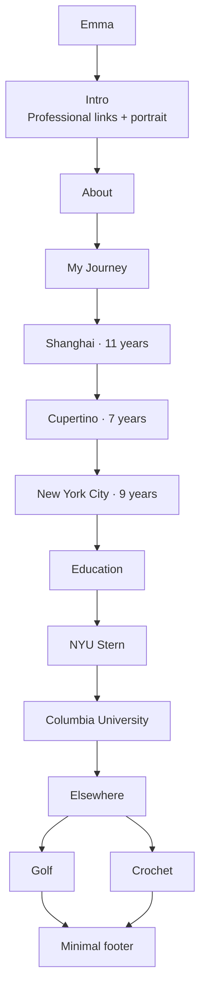

# Design brief

## Intent

Emma's personal website should feel like a thoughtfully assembled personal notebook: warm, editorial, and specific, without becoming a literal scrapbook or a conventional portfolio template.

The private reference concept is the visual north star. It establishes composition, hierarchy, palette, and mood. It does not supply approved biography, photography, URLs, or a required domain.

## Page structure

The first version is one continuous page:

There is no top navigation, projects grid, blog, contact form, router, or dark mode in the first version.

## Translating the reference into the website

### Preserve

- Warm off-white paper background with subtle texture
- Handwritten identity, headings, city labels, and short annotations
- Asymmetric portrait composition with a light paper frame and one tape detail
- Spacious About section with a restrained architectural sketch
- Chronological three-city journey with hand-drawn connectors
- Layered photo and illustration compositions instead of generic cards
- Binder-style Golf and Crochet tabs
- Paired Crochet frames that reveal transformation and use without adding extra cards
- Open sketchbook-style Education spread with school-color line drawings
- Muted blush, sage, blue, sand, and olive accents
- Fine rules, light shadows, and slightly imperfect rotations

### Adapt deliberately

- The reference uses handwriting for nearly all copy. Long paragraphs should use a clean sans-serif for legibility; handwriting remains the expressive display voice.
- The reference omits GitHub, LinkedIn, and résumé links. The live Intro must include one understated set of these links because they are essential site content.
- The browser URL shown in the image is illustrative. GitHub Pages can use its free URL, and a custom domain remains optional.
- The mockup is a fixed desktop composition. Tablet and mobile layouts should simplify secondary decoration before reducing readability or touch-target size.
- Captions and personal statements visible in the concept are directional examples, not approved final copy.
- Approved personal portrait and hobby photography replace the original composition placeholders; generated city illustrations remain part of the final art direction.

## Visual system

### Typography

- Display: a handwriting-inspired face such as Kalam
- Body and utility text: Inter or a comparable sans-serif
- No serif display type
- Avoid oversized marketing typography

### Color

- Use warm neutrals for most of the page
- Reserve muted pastels for tape, tabs, underlines, washes, and paper layers
- Keep body text dark enough for accessible contrast

### Composition

- Begin with a disciplined editorial grid and generous whitespace
- Add scrapbook character through layering, not decorative clutter
- Prefer one strong visual idea per section
- Keep borders thin, corners modest, and shadows restrained
- Avoid rounded SaaS cards, glass effects, bright highlight blocks, and ornamental stickers

## Interaction and accessibility

- Use semantic headings and landmarks
- Make every link and control keyboard accessible with visible focus
- Implement Golf and Crochet as an accessible tab pattern using native buttons
- Provide meaningful alt text for content images and hide decorative art from assistive technology
- Respect reduced-motion preferences
- Maintain practical touch targets and prevent horizontal overflow
- Do not lazy-load the primary portrait; reserve image geometry throughout the page

## Content boundaries

Approved personal copy and professional URLs live in the typed content modules. Keep future revisions concise, grounded in information Emma has provided, and free of invented biographical details.

The final footer should remain minimal: `Emma · 2026`.
